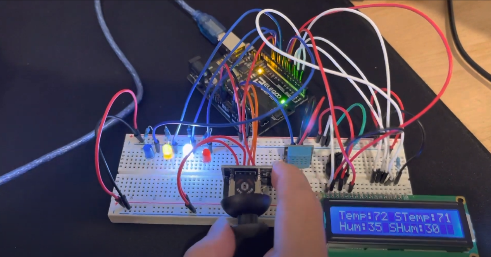

# mock-AC-unit
Arduino project of a mock air conditioning system.
 
Using an ELEGOO UNO R3 board, I made a mock AC system. The joystick module controls STemp and SHum which stands for set temperature and set humidity. The colored LED lights represent the AC's actions.
Red is heating up the room, white is cooling down, yellow is lowering the humidity, and blue is raising the humidity. If the room temperature and set temperature are the same then the two LED lights
are disabled. The same happens with the LED lights for humidity.
These readings are displayed on a LCD1602 display. I used a DHT11 module to return live readings of the environment's temperature and humidity. 

Viewable demo can be found here:

